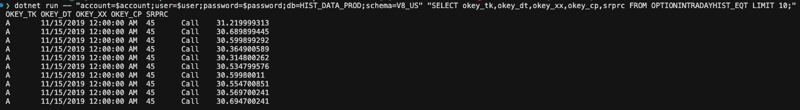

# Snowflake Query Runner

A simple .NET console application that showcases how the Snowflake.Data package can be used to execute SQL queries against a Snowflake database and output the results in a tab-separated format.

## Dependencies

- **Runtime**: [.NET 8.0 SDK](https://dotnet.microsoft.com/download/dotnet/8.0) or later.
- **Packages**:
  - `Snowflake.Data` (v5.4.0) - The official Snowflake .NET driver. For more information, visit the [official GitHub repository](https://github.com/snowflakedb/snowflake-connector-net).

## Build Process

To build the project, navigate to the `snowflake` directory and use the .NET CLI:

### 1. Restore Dependencies
Download the required NuGet packages:
```bash
dotnet restore
```

### 2. Build the Project
Compile the application:
```bash
dotnet build
```
The compiled binaries will be located in `bin/Debug/net8.0/`.

## Usage

Run the compiled executable with a connection string and the SQL query as arguments:

```bash
dotnet run -- "<connection_string>" "<query>"
```

### Example
```bash
dotnet run -- "account=myaccount;user=myuser;password=mypass;db=HIST_DATA_PROD;schema=<V8_US|V8_EU>" "SELECT okey_tk,okey_dt,okey_xx,okey_cp,srprc FROM OPTIONINTADAYHIST_EQT WHERE date_p='2026-02-05' AND okey_tk='AAPL'"
```



The output will be tab-separated, with the first row containing column names.
