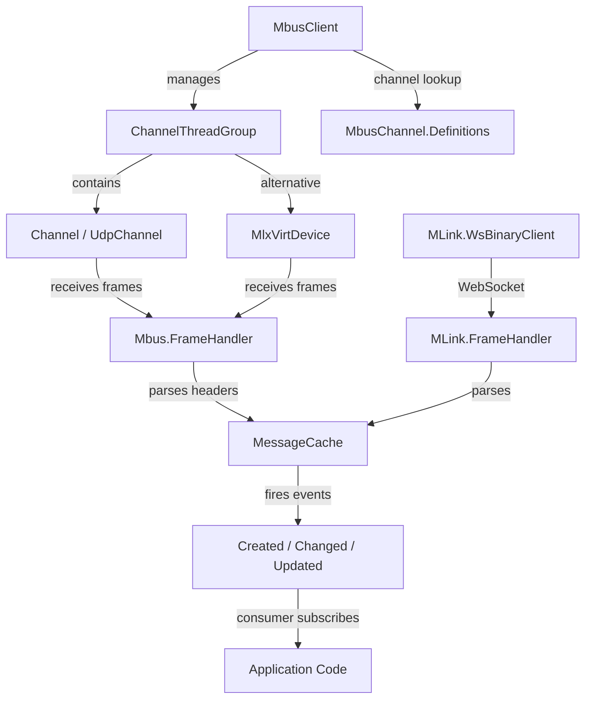

# SpiderRock.SpiderStream

> High-performance .NET 6 library for consuming SpiderRock's SpiderStream (MBUS) normalized multicast market data feed, supporting both OS sockets and Mellanox kernel-bypass networking.

## Architecture

SpiderRock.SpiderStream is the C# SDK for connecting to SpiderRock's proprietary MBUS multicast market data infrastructure. The library centers on the `MbusClient` class, which manages one or more `ChannelThreadGroup` instances that each listen on a set of UDP multicast endpoints. Incoming network frames are processed through a `FrameHandler` pipeline that parses MBUS binary headers, validates sequence numbers, and dispatches individual messages to the `MessageCache`.

The `MessageCache` maintains a thread-safe in-memory store of the latest state for each message type, keyed by the message's primary key layout (e.g., TickerKey, OptionKey, ExpiryKey). When messages arrive, the cache fires Created, Changed, and Updated events that consumers subscribe to for real-time data handling. The system uses unsafe code and aggressive inlining for minimal latency in the hot path.

The networking layer provides two implementations: `OSSockets` using standard .NET UDP multicast joins, and `FastSockets` using Mellanox ConnectX kernel-bypass via P/Invoke for sub-microsecond latency. Channel definitions are registered statically in `MbusChannel.Definitions` with multicast addresses derived from the system environment (Saturn, SysTest, Production). The `MLink` namespace provides an alternative WebSocket-based binary client for non-multicast environments.

All message types, enums, formatters, and cache registrations are auto-generated from MBUS definition files, keeping the hand-written framework code separate from the schema-driven message boilerplate.

## Key Files

| File | Purpose |
|------|---------|
| `MbusClient.cs` | Central entry point; manages channel groups and event dispatch |
| `MbusChannel.cs` | Channel name registry and multicast address generation |
| `MbusChannel.Definitions.cs` | Static channel endpoint definitions per environment |
| `Channel.cs` | Per-channel statistics tracking and lifecycle |
| `ChannelThreadGroup.cs` | Thread group managing multiple channels on one receive loop |
| `MessageCache.cs` | Generic keyed message store with event notification |
| `Mbus/FrameHandler.cs` | Binary frame parser with header validation and dispatch |
| `Mbus/Header.cs` | MBUS frame header structure |
| `Mbus/Formatter.cs` | Binary serialization/deserialization helpers |
| `MLink/WsBinaryClient.cs` | WebSocket-based alternative to multicast |
| `OSSockets/UdpChannel.cs` | Standard OS UDP multicast channel |
| `FastSockets/MlxVirtDevice.cs` | Mellanox kernel-bypass device wrapper |
| `Diagnostics/LatencyTracker.cs` | Frame processing latency measurement |

## Data Flow

| Stage | Description |
|-------|-------------|
| Channel Join | MbusClient joins multicast groups via UdpChannel or MlxVirtDevice |
| Frame Receive | Raw UDP datagrams arrive on channel thread; jumbo frames reassembled |
| Header Parse | FrameHandler reads MBUS Header (msgtype, msglen, keylen, hdrlen) |
| Message Decode | MessageCache routes to typed handler based on MessageType |
| Cache Update | Message stored/updated in keyed dictionary; events fired |
| Event Dispatch | Application receives Created/Changed/Updated EventArgs |

## Dependencies

| Project | Role |
|---------|------|
| (none) | Zero external project references; self-contained library |

## See Also

- `docs/VOCABULARY.md`
